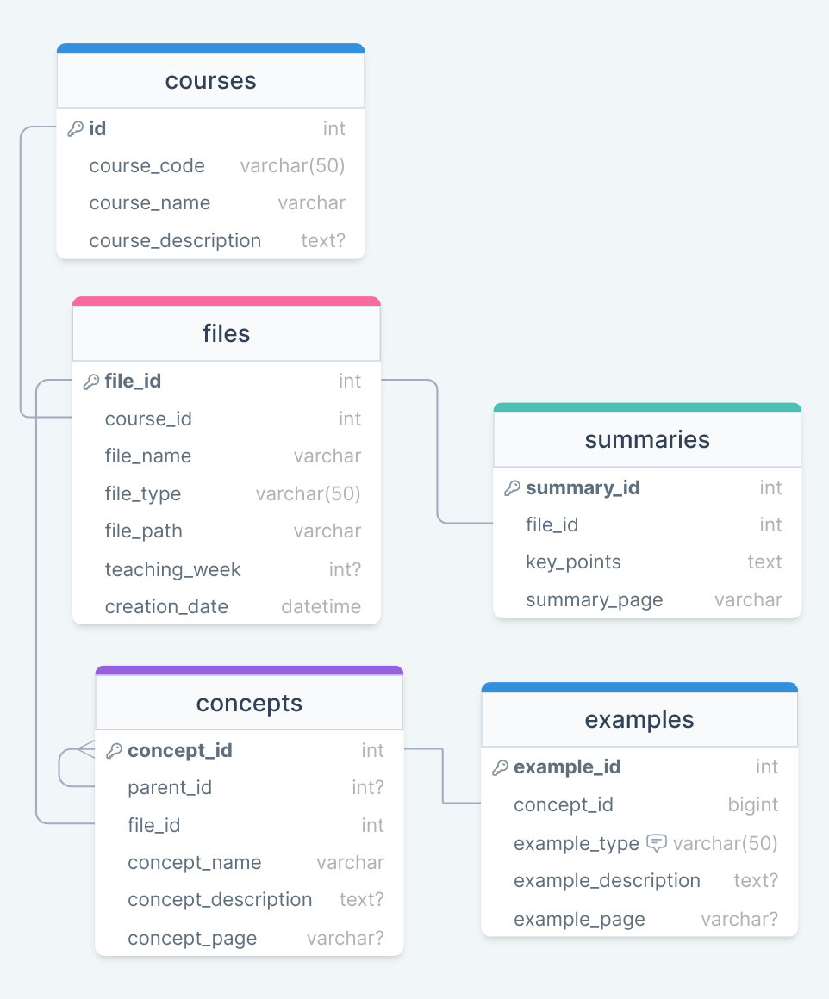

# PassGPT-Demo
A course-specific chat model powered by GPT. 

Make you learn efficiently and **Pass** the course! Let's meet **PassGPT**!

<div style="text-align: center;">
  
</div>

## Project Status

This repository marks the conclusion as a course project. For ongoing developments and future updates on PassGPT, please visit the new repository at [PassGPT](https://github.com/Kexueyi/PassGPT).

Thank you for your interest and support!

## Introduction

We aim to bridge the gap between general chatbots and course-specific chatbots. While general LLMs are proficient in generating human-like text, they lack course-specific knowledge. 

Our goal is to combine the strengths of both by building a course-specific chat model powered by GPT, utilizing the dataset from the EE6405: Natural Language Processing course.

## Main Functions
1. Course information retrieval. e.g. course materials, concepts related informations
2. Generate course-specific content. e.g. examples, sample practices, quiz
3. Study & review assistance. e.g. summarize, tips 

## Working Flow
### Data Preprocessing

We preprocess the course materials from EE6405: Natural Language Processing, including slides and code materials, using:

- Traditional NLP methods *(e.g. TF-IDF, LDA, etc.)*
- Multimodel-GPT-4

By extracting structured information from the course materials, and build a database for the course-specific chat model.

### Database Construction


The database is constructed using **MySQL**, by the following schema:

<!--  -->

<!-- Using HTML adjust size -->
<div style="text-align: center;">
  
</div>

Structure: `Courses` -> `Files` -> `Concepts` -> `Subconcepts` -> `Examples`

The `concepts` table has hierarchical structure by using `concept_id` and `parent_id` to fully represent the content structure.

### Model (Agent)
We propose a novel Agent model combined from 2 parts:

- Query GPT: process the user input into SQL query, interacting with our database.
- Course GPT: generate the course-specific content based on the query result.

Both parts are based on GPT-4, without any additional training/fine-tuning.

## Repository Overview
- `data/`: Note that we are not able to release the original course matrials due to the policy.
  - `json/`: extracted structed course `.json` file from GPT-4 also traditional NLP methods.
- `database/`:
  - `json_to_sql.py`: using `.json` to insert entries into SQL database.
  - `pgpt_db.sql`: You can construct same database by running this script.
- `models/`: Models for PassGPT.
  - `pass_gpt.py`: The main model(agent) for PassGPT.
- `main.py`: Main script for running PassGPT.
- `example_results/`: Example results of PassGPT, where some of them are good/bad examples(indicating the requirements of well-structrued user input)
- `preprocess/`:
  - `traditional_nlp/`: Traditional NLP methods for data (slides) preprocessing.
- `requirements.txt`: List of packages required to run the code.
- `final_presenation.pdf`: Final presentation slides for reference.


## Setup
### Environment
The packages are listed in requirements.txt. Run the following command for setting up the environment:
```bash
conda create --name pgpt --file requirements.txt
conda activate pgpt
```

### Database
You can construct your own `MySQL` database by running the following command:
```bash
mysql -u root -p < database/pass_gpt.sql
```
Then modify the `models/pass_gpt.py` database information to your own database.

### OpenAI API
You need to have an OpenAI API key to run the code. You can get one from [OpenAI](https://beta.openai.com/signup/). Once you have the key, you can set it as an environment variable:
```bash
vi ~/.bashrc # open your bashrc file
export OPENAI_API_KEY="your-api-key" # add this line in your bashrc
# :wq to save and exit
source ~/.bashrc
```

### Run
You can run the code in your terminal by:
```bash
python main.py
```

Then you can input your questions or commands to PassGPT in the terminal as show in the figure below:
<div style="text-align: center;">
  
</div>

Enjoy your learning journey with PassGPT!


## Contributors

- **Ke Xueyi**: 
  - Conceptualization and idea development.
  - Scripting of the model demo.
  - Database construction, setup, and management.
  - Scripting and integration of the final agent.
  - Repository management.

- **Gu Yuhao**: 
  - Application of traditional NLP techniques for preprocessing slide materials.
  - Video Editing for final presentation.

- **Jia Yunfeng & Lai Bohan**: 
  - Prompt engineering for quiz and practice generation.
  - Preprocessing of code materials data.

- **Zhao Neng**: 
  - Utilization of GPT-4 for data preprocessing in slide materials.
  - Attempted front-end demo development.

- **Zhang Jiali**: 
  - Application of ANTLR for data preprocessing in code materials.
