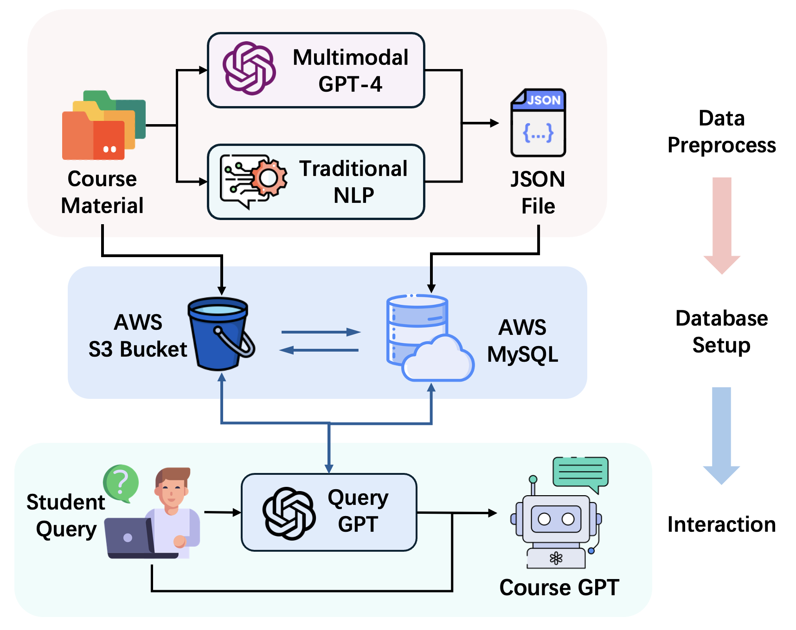

# PassGPT
A course-specific chat model powered by GPT. Make you learn efficiently and Pass! Let's meet PassGPT!



## Introduction

The goal of this project is to build a course-specific chat model powered by GPT, by utlizing the dataset build upon the course materials from EE6405: Natural Language Processing.

## Main Functions
1. Course information retrieval. e.g. course materials, concepts related informations
2. Generate course-specific content. e.g. examples, sample practices, quiz
3. Study & review assistance. e.g. summarize, tips 

## Repository Overview
- `data/`: Note that we are not able to release the original course matrials due to the policy.
  - `slides`: slides from EE6405
  - `code/`: code material from EE6405
  - `json/`: extracted structed course `.json` file from GPT-4 also traditional NLP methods.
    - `gpt.json`: GPT-4 extracted course information.(which is used for build database)
- `database/`:
  - `json_to_sql.py`: convert `.json` to insert entries into SQL database.
  - `pgpt_db.sql`: You can construct same database by running this script.
- `models/`: Models for PassGPT.
  - `pass_gpt.py`: The main model for PassGPT.
- `main.py`: Main script for running PassGPT.
- `example_results/`: Example results of PassGPT, where some of them are good/bad examples(indicating the requirements of well-structrued user input)
- `preprocess/`:
  - `ANTLR/`: ANLTR for data (code) preprocessing. Part of code source from [ANTLR](https://www.antlr.org/)
    - `main.py`: Main script for process data (code) files.
  - `traditional_nlp/`: Traditional NLP methods for data (slides) preprocessing.
- `web/`: Web interface for PassGPT. (unfinished)
- `requirements.txt`: List of packages required to run the code.


## Setup
### Environment
The packages are listed in requirements.txt. Run the following command for setting up the environment:
```bash
conda create --name pgpt --file requirements.txt
conda activate pgpt
```

### Database
You can construct your own `MySQL` database by running the following command:
```bash
mysql -u root -p < database/pass_gpt.sql
```
Then modify the `models/pass_gpt.py` database information to your own database.

### OpenAI API
You need to have an OpenAI API key to run the code. You can get one from [OpenAI](https://beta.openai.com/signup/). Once you have the key, you can set it as an environment variable:
```bash
vim ~/.bashrc
export OPENAI_API_KEY="your-api-key" # add this line in your bashrc
# :wq
source ~/.bashrc
```

### Run
You can run the code in your terminal by:
```bash
python main.py
```

Then you can input your questions or commands to PassGPT in the terminal as show in the figure below:


Enjoy your learning journey with PassGPT!
